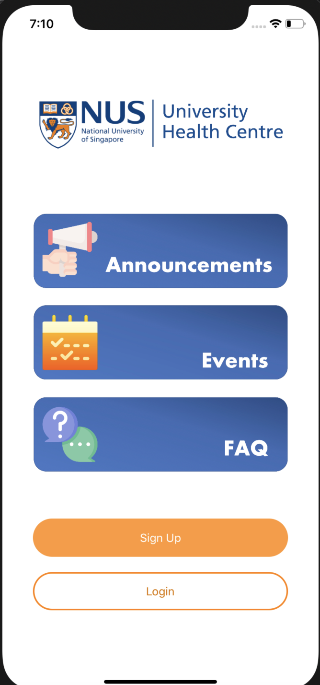
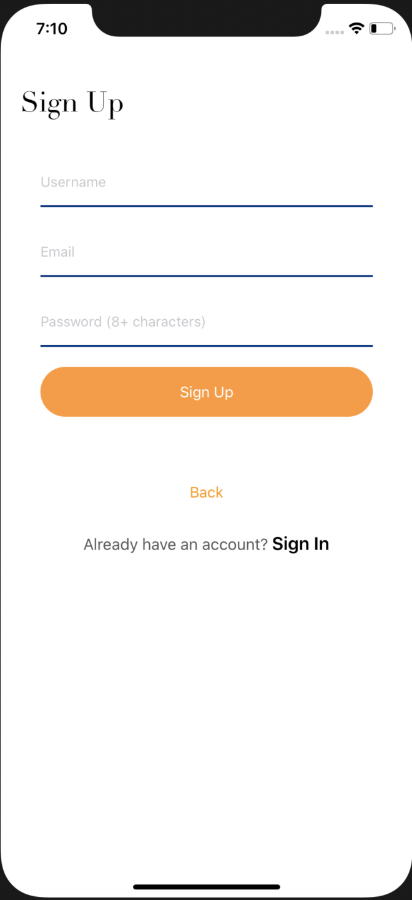
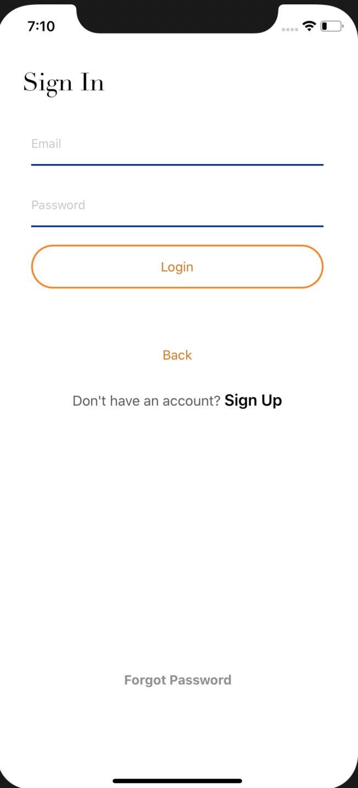
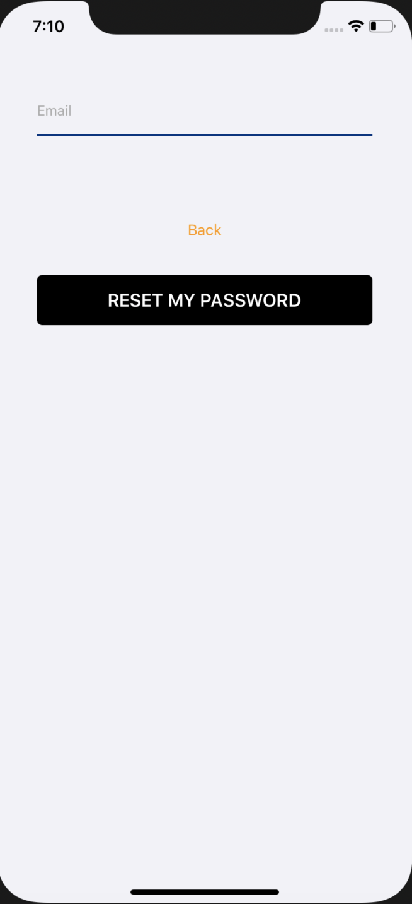
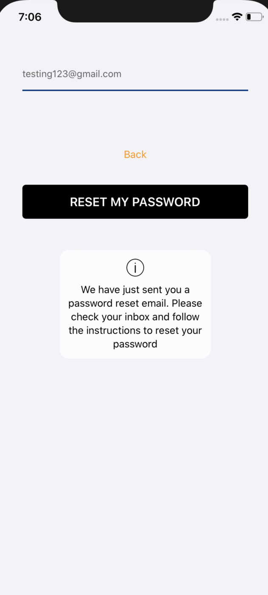
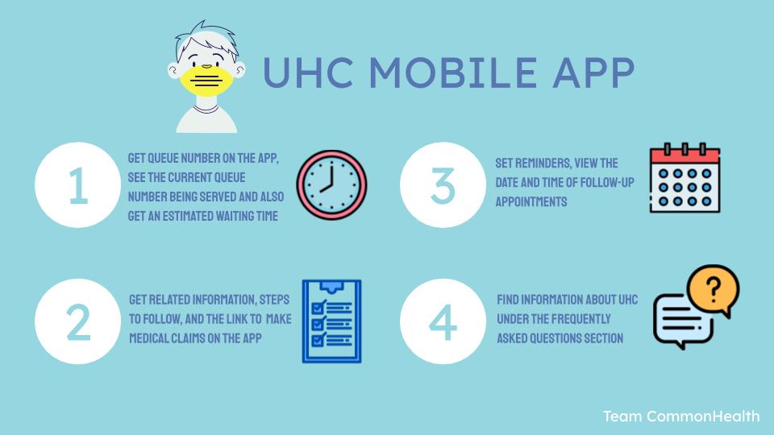

# CommonHealth
 
 
## About this Project 
Our team observed that as students, time is essential and limited, so making effective use of our time is key. Usually, we spend a large proportion of our time waiting in line at the University Health Centre waiting to see the doctor. Thus, we formulated an IOS mobile application to help students better take care of their health. Using the application, users are able to get the queue number online and check the estimated waiting time. As such, users are able to plan the time they leave and make their way to the clinic and reduce their waiting time at the health centre itself. We plan to extend the project to involve the various clinics around Singapore.

## Features Explained
The features that the application has are the following:

- *User Login* :

User Login is done using Firebase Authentication, where users are required to input a Username, Email and Password upon registration. During registration, a unique username, email and password is required and a scan is done to check if the username already exists.

- *Queue System* :

Allows users to request for a queue number and see the current waiting time/number of people currently in queue. 
Notifies users when their turn is near

- *Calendar System* :

Users are able to view the date and time of follow-up appointments (if any) in the mobile application. Reminders and notifications will also be set to remind users about their upcoming appointment.

## App Screenshots
<table>
  <tr>
    <td> Main Menu </td>
    <td> Sign Up Page </td>
    <td> Login Page </td>
    <td> Forgot Password Page </td>
  </tr> 
  <tr> 
    <td>  </td>
    <td>  </td>
    <td>  </td>
    <td> 
       </td>
  </tr>
  </table>

## Poster and Video

 

**Link to Video** : https://youtu.be/50yCR8v9Gsk
                                                              

